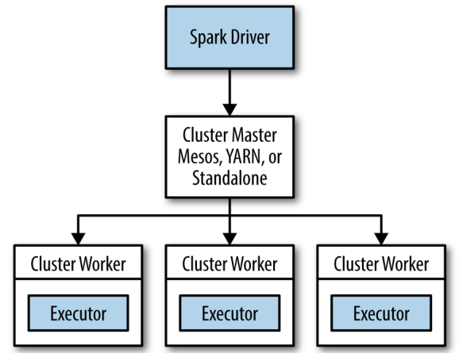

## 在集群上运行spark
  
在分布式环境下,Spark集群采用的是主从结构.在一个Spark集群中,有一个节点负责中央协调,调度各个分布式工作节点.这个中央协调节点被称为驱动器(Driver)节点.与之对应的工作节点被称为执行器(executor)节点.驱动器节点可以和大量的执行器节点进行通信,它们也都作为独立的Java进程运行.驱动器节点和所有的执行器节点一起被称为一个Spark应用.  
Spark应用通过一个叫做集群管理器(Cluster Manager)的外部服务在集群冲的机器上启动.Spark自带的集群管理器被称为独立集群管理器.  

### 驱动器节点
驱动器程序在Spark应用中有下述两个职责:  
1. 将用户程序转为任务:Spark驱动器程序负责把用户程序转为多个物理执行的单元,这些单元也被称为任务(task).Spark程序隐式的创建了一个由操作组成的逻辑上的有向无环图(Directed Acyclic Graph, DAG).当驱动器执行时,它会把这个逻辑图转为物理执行计划.  
Spark会对逻辑执行计划做一些优化,比如将连续的映射转为流水线化执行,将多个操作合并到一个步骤中等.这样spark就把逻辑计划转为一系列步骤(stage).而每个步骤又由多个任务组成.这些任务会被打包并送到集群中.任务是spark中最小的工作单元,用户程序通常要启动成百上千的独立任务.  
2. 为执行器节点调度任务:执行器进程启动后,会向驱动器进程注册自己.因此,驱动器进程始终对应用中所有的执行器节点有完整的记录.每个执行器节点代表一个能够处理任务和存储RDD数据的进程.  
Spark驱动器程序会根据当前的执行器节点集合,尝试把所有任务基于数据所在位置分配给合适的执行器进程.当任务执行时,执行器进程会把缓存数据存储起来,而驱动器进程同样会追踪这些缓存数据的位置,并且利用这些位置信息来调度以后的任务,以尽量减少数据的网络传输.  

### 执行器节点
执行器进程有两大作用:  
1. 负责运行组成spark应用的任务,并将结果返回给驱动器进程.  
2. 通过自身的块管理器(Block Manager)为用户程序中要求缓存的RDD提供内存式存储.RDD是直接缓存在执行器进程内的,因此任务可以在运行时充分利用缓存数据加速运算.  

### 集群管理器
spark依赖于集群管理器来启动执行器节点,而在某些特殊情况下,也依赖集群管理器来启动驱动器节点.集群管理器是可插拔式组件.  

### Spark应用详细过程
1. 通过spark-submit提交应用
2. spark-submit脚本启动驱动器程序,调用用户定义的main()方法
3. 驱动器程序与集群管理器通信, 申请资源以启动执行器节点
4. 集群管理器为驱动器程序启动执行器节点
5. 驱动器进程执行用户应用中的操作.根据程序中所定义的对RDD的转化操作和行动操作,驱动器工作节点把工作以任务的形式发送到执行器进程.
6. 任务在执行器程序中进行计算并保存结果
7. 如果驱动器程序的`main()`方法退出,或者调用了`SparkContext.stop()`,驱动器程序会终止执行器进程,并且通过集群管理器释放资源.  

### 打包代码与依赖
一般Java和Scala的工程都会依赖很多库.常规的做饭是使用构建工具,生成单个大JAR包,包含应用的所有传递依赖.称为超级(uber)JAR或者组合(assembly)JAR.  
使用Maven打包:  
把spark标记为`provided`来确保Spark不与应用依赖的其他工件打包在一起.构建时,我们使用`maven-shade-plugin`插件来创建出包含所有依赖的超级JAR包.  
#### 依赖冲突
当用户应用与Spark本身依赖同一个库时可能会发生依赖冲突,导致程序崩溃.一是修改应用,使其依赖库版本与spark使用的相同,二是使用"shading"的方式打包.  

## Spark调优与调试
### 配置spark
spark配置优先级:  
用户代码 > spark-submit > 配置文件 > 系统默认  

### Spark执行
 - 用户代码定义RDD的有向无环图(DAG)
 - 行动操作把有向无环图强制转译为执行计划
 - 任务于集群中调度并执行

### 查找信息
 - Spark网页用户界面
 - 驱动器进程和执行器进程的日志

### 关键性能考量
1. 并行度
 - 并行度过低,spark集群会出现资源闲置
 - 并行度过高,每个分区产生的间接开销累计起来就会更大.评判并行度是否过高的标准包括任务是否是几乎在瞬间(毫秒级)完成的,或者是否观察到任务没有读写任何数据.    
 调优的方法:第一种是在数据混洗操作时,使用参数的方式为混洗后的RDD指定并行度.第二种方法是对于任何已有的RDD,可以进行重新分区来获取更多或者更少的分区数.重新分区操作通过`repartition()`实现,该操作会把RDD随机打乱并分成设定的分区数目.如果你确定要减少RDD分区,可以使用`coalesce()`操作.由于没有打乱数据,该操作比`repartition()`更加高效.如果你认为当前的并行度过高或者过低,可以利用这些方法对数据进行重新调整.  
比如对一个RDD进行`filter()`操作,返回后的RDD分区数默认和其父节点一样,这样可能会产生很多空的分区或者只有很少数据的分区.在这样的情况下,可以通过合并得到的分区更少的RDD来提高应用性能.  

2. 序列化格式
当Spark需要通过网络传输数据,或是将数据溢写到磁盘上时,Spark需要把数据序列化为二进制格式.序列化会在数据进行混洗操作时发生,此时有可能需要通过网络传输大量数据.  
默认情况下,spark会使用Java内建的序列化库,第三方库`Kryo`可以提升性能.  
如果代码中引用到了一个没有扩展Java的`Serializable`接口的类,会遇到`NotSerializableException`.  

3. 内存管理
RDD存储: 当调用RDD的`persist()`或者`cache()`方法时,这个RDD的分区会被存储到缓存区中.Spark会根据`spark.storage.memoryFracvtion`限制用来缓存的内存占整个JVM堆空间的比例大小.超出限制,旧的分区数据会被移出内存.  
数据混洗与聚合的缓存区:当进行数据混洗操作时,Spark会创建出一些中间缓冲区来存储数据混洗的输出数据.这些缓冲区用来存储聚合操作的中间结果,以及数据混洗操作中直接输出的部分缓冲数据.Spark会尝试根据`spark.shuffle.memoryFraction`限定这种缓冲区内存占总内存的比例.  
用户代码: 用户代码可以访问JVM堆空间中除分配给RDD存储和数据混洗存储以外的全部剩余空间.  

默认情况下,Spark会使用60%的空间来存储RDD,20%空间存储数据混洗操作产生的数据,剩下的20%留给用户程序.用户可以自行调节.  

Spark的`cache`操作会以`MEMORY_ONLY`的存储等级持久化数据.这意味着RDD分区时空间不够,旧的分区就会被直接删除.当用到这些分区数据时,再重新重算.所以有时以`MEMORY_AND_DISK`的存储等级调用`persist()`方法会获得更好的效果,因为在这种存储等级下,内存中放不下的旧分区会被写入磁盘,当再次需要用到的时候再从磁盘上读取回来.这样的代价有可能比重算要低得多,也可以带来更稳定的性能表现.  
对于默认缓存策略的另一个改进是缓存序列化后的对象而非直接缓存,我们可以通过`MEMORY_ONLY_SER`或`MEMORY_AND_DISK_SER`的存储等级来实现这一点.缓存序列化后的对象会使缓存过程变慢,因为序列化对象也需要一些代价,不过这样可以显著减少JVM的垃圾回收时间,因为很多独立的记录现在可以作为单个序列化的缓存而存储.垃圾回收的代价与堆里的对象数目有关,而不是与数据的字节数有关.这种缓存方式会把大量对象序列化为一个巨大的缓存区对象.  

### 硬件供给
"越多越好"的原则在设置执行器节点内存时并不一定适用.适用巨大的堆空间可能会导致垃圾回收的长时间暂停,从而严重影响spark作业的吞吐量.  