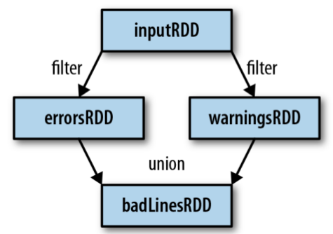

初始化SparkContext:先创建一个SparkConf对象来配置应用，然后基于这个SparkConf来创建SparkContext对象。
```Scala
import ...
val conf = new SparkConf().setMaster("local").setAppName("My App")
val sc = new SparkContext(conf)
```

Spark中的RDD就是一个不可变的分布式对象集合，每个RDD都被分为多个分区，这些分区运行在集群中的不同节点上，RDD中可以包含任意类型对象。  
创建RDD的方法：
 - 读取一个外部数据集
 - 在驱动器程序里分发驱动器程序中的对象集合
创建好的RDD支持两种类型的操作：转换操作(transformation)和行动操作(action)  
惰性计算：只在第一次在一个行动操作中用到时，才会真正计算。  
如果想在多个行动操作中重用同一个RDD，就可以使用`RDD.persist()`让spark把这个RDD缓存下来。  

SparkContext的`parallelize()`方法可以创建RDD
```Scala
val lines = sc.parallelize(List("pandas", "i like pandas"))
```
从外部存储中读取数据创建RDD
```Scala
val lines = sc.textFile("README.md")
```

RDD转化操作：
所有的转化操作都是惰性求值的。  
```Scala
val inputRDD = sc.textFile("log.txt")
val errorsRDD = inputRDD.filter(line => line.contains("error"))
```
RDD转化操作是从已有的RDD中派生出新的RDD，Spark会使用谱系图(lineage graph)来记录不同RDD之间的依赖关系，例如：  
  

RDD行为操作：  
行为操作讲最终求得的结果返回到驱动器程序，或者写入外部存储系统中。由于行动操作需要生成实际的输出，会强制执行那些求值必须用到的RDD的转化操作。  
```Scala
errorsRDD.take(10).foreach(println)
```

RDD的`collect()`函数可以获取整个RDD中的数据，如果RDD的数据能在单台机器的内存中放得下时，就可以使用它，所以RDD不能用在大规模数据集上。  
也可以用`saveAsTextFile()` `saveAsSequenceFile()`或其他行动操作将RDD的数据内容以各种自带的格式保存起来。  

惰性求值：被调用行为操作之前Spark不会开始计算。当我们调用转化操作时，操作不会立即执行。Spark会在内部记录下所要求执行的操作的相关信息。我们不应该把RDD看作存放特定数据的数据集，而最好把每个RDD当作我们通过转化操作构建出来的、记录如何计算数据的指令列表。把数据读取到RDD的操作也同样是惰性的。和转化操作一样的是，读取数据的操作也可能会多次执行。  
Spark使用惰性求值，就可以把一些操作合并到一起来减少计算数据的步骤。在Spark中，写出一个非常复杂的映射并不见得能比使用很多简单的连续操作获得好很多的性能。  


向spark传递函数：
向spark传递的函数及其引用的数据需要是可序列化的（实现了Java的Serializable接口），否则会出现`NotSerializableException`.