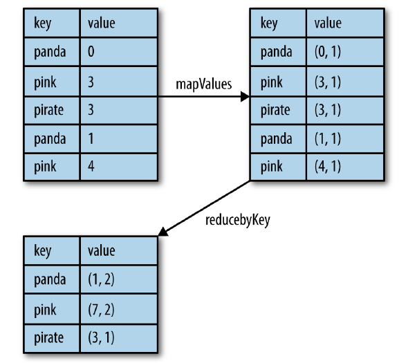

## RDD基础

初始化SparkContext:先创建一个SparkConf对象来配置应用，然后基于这个SparkConf来创建SparkContext对象。
```Scala
import ...
val conf = new SparkConf().setMaster("local").setAppName("My App")
val sc = new SparkContext(conf)
```

### RDD基本操作

Spark中的RDD就是一个不可变的分布式对象集合，每个RDD都被分为多个分区，这些分区运行在集群中的不同节点上，RDD中可以包含任意类型对象。  
创建RDD的方法：
 - 读取一个外部数据集
 - 在驱动器程序里分发驱动器程序中的对象集合
创建好的RDD支持两种类型的操作：转换操作(transformation)和行动操作(action)  
惰性计算：只在第一次在一个行动操作中用到时，才会真正计算。  
如果想在多个行动操作中重用同一个RDD，就可以使用`RDD.persist()`让spark把这个RDD缓存下来。  

SparkContext的`parallelize()`方法可以创建RDD
```Scala
val lines = sc.parallelize(List("pandas", "i like pandas"))
```
从外部存储中读取数据创建RDD
```Scala
val lines = sc.textFile("README.md")
```

RDD转化操作：
所有的转化操作都是惰性求值的。  
```Scala
val inputRDD = sc.textFile("log.txt")
val errorsRDD = inputRDD.filter(line => line.contains("error"))
```
RDD转化操作是从已有的RDD中派生出新的RDD，Spark会使用谱系图(lineage graph)来记录不同RDD之间的依赖关系，例如：  
  

RDD行为操作：  
行为操作讲最终求得的结果返回到驱动器程序，或者写入外部存储系统中。由于行动操作需要生成实际的输出，会强制执行那些求值必须用到的RDD的转化操作。  
```Scala
errorsRDD.take(10).foreach(println)
```

RDD的`collect()`函数可以获取整个RDD中的数据，如果RDD的数据能在单台机器的内存中放得下时，就可以使用它，所以RDD不能用在大规模数据集上。  
也可以用`saveAsTextFile()` `saveAsSequenceFile()`或其他行动操作将RDD的数据内容以各种自带的格式保存起来。  

惰性求值：被调用行为操作之前Spark不会开始计算。当我们调用转化操作时，操作不会立即执行。Spark会在内部记录下所要求执行的操作的相关信息。我们不应该把RDD看作存放特定数据的数据集，而最好把每个RDD当作我们通过转化操作构建出来的、记录如何计算数据的指令列表。把数据读取到RDD的操作也同样是惰性的。和转化操作一样的是，读取数据的操作也可能会多次执行。  
Spark使用惰性求值，就可以把一些操作合并到一起来减少计算数据的步骤。在Spark中，写出一个非常复杂的映射并不见得能比使用很多简单的连续操作获得好很多的性能。  


向spark传递函数：
向spark传递的函数及其引用的数据需要是可序列化的（实现了Java的Serializable接口），否则会出现`NotSerializableException`.  

常见的转化操作和行动操作
```Scala
val input = sc.parallelize(List(1, 2, 3, 4))
val result = input.map(x => x*x)
println(result.collect().mkString(","))

val lines = sc.parallelize(List("hello world", "hi"))
val words = lines.flatMap(line => line.split(" "))
words.first()

val sum = rdd.reduce((x, y) => x + y)
```

在不同RDD类型间转换  
有些函数只能用于特定类型的RDD，在Scala中，将RDD转为有特定函数的RDD是由隐式转换来自动处理的。  
```Scala
import org.apache.spark.SparkContext._
```

持久化  
spark RDD是惰性求值的，有时我们希望能多次使用同一个RDD。如果简单地对RDD调用行动操作，Spark每次都会重算RDD以及它的所有依赖。这在迭代算法中消耗格外大，因为迭代算法常常会多次使用同一组数据。  
两次执行：
```Scala
val result = input.map(x => x*x)
println(result.count())
println(result.collect().mkString(","))
```
为了避免多次计算同一个RDD，可以让Spark对数据进行持久化。当我们持久化存储一个RDD时，计算出RDD的节点会分别保存它们所求出的分区数据。  
`persist()`会把数据以序列化的形式缓存在JVM的堆空间中，如果要缓存的数据太多，内存中放不下，Spark会自动利用最近最少使用(LRU)的缓存策略把最老的分区从内存中移除。  
```Scala
import org.apache.spark.storage.StorageLevel
val result = input.map(x => x*x)
result.persist(StorageLevel.DISK_ONLY)
println(result.count())
println(result.collect().mkString(","))
```

### 键值对操作
键值对RDD: pair RDD  
可以并行操作各个键或跨节点重新进行数据分组的操作接口.  
创建一个pair RDD:
```Scala
val pairs = lines.map(x => (x.split(" ")(0), x))

pairs.filter{case (key, value) => value.length < 20}
```
聚合操作
```Scala
rdd.mapValues(x => (x, 1)).reduceByKey((x, y) => (x._1 + y._1, x._2 + y._2))
```
  
单词计数:  
```Scala
val input = sc.textFile("...")
val words = input.flatMap(x => x.split(" "))
val result = words.map(x => (x, 1)).reduceByKey((x, y) => x + y)
```
或者
```Scala
val result = input.flatMap(x => x.split(" ")).countByValue()
```
`countByKey()`是基于键进行聚合的函数
```Scala
val result = input.combineByKey(
    (v) => (v, 1),
    (acc: (Int, Int), v) => (acc._1 + v)
)
```
并行度调优:第二个参数用来指定分组结果或聚合结果的RDD分区数
```Scala
val data = Seq(("a", 3), ("b", 4), ("a", 1))
sc,parallelize(data).reduceByKey((x, y) => x + y)
sc,parallelize(data).reduceByKey((x, y) => x + y, 10)
```

### 数据分区

每个RDD都有固定数目的分区，分区数决定了在RDD上执行操作时的并行度。  
repartition()函数，把数据通过网络进行混洗，并创建出新的分区集合。对数据进行重新分区是一个代价比较大的操作，spark有一个优化版的repartition()叫做coalesce()。  
可以使用`rdd.patitions.size`来查看分区数，并确保调用`coalesce()`时将RDD合并到比现在的分区数更少的分区中。  
数据分区  
partitionBy()是一个转化操作，因此它的返回值总是一个新的RDD

在分布式程序中，通信的代价是很大的，因此控制数据分布以获得最少的网络传输可以极大的提升整体性能。spark可以通过控制RDD分区来减少通信开销。分区不是对所有应用都是有好处的--比如如果给定RDD只被扫描一次，我们完全没有必要对其预先进行分区处理。只有当数据集多次在诸如连接这种基于键的操作中使用时，分区才会有帮助。  
Spark所有的键值对RDD都可以进行分区。系统会根据一个针对键的函数对元素进行分组。尽管spark没有给出显示控制每一个键具体落在哪一个工作节点上，但spark可以确保同一组的键出现在同一个节点上。比如使用哈希分区将一个RDD分成了100个分区，此时键的哈希值对100取模的结果相同的记录会被放在一个节点上。或者使用范围分区法，将键在同一个范围区间内的记录都放在同一个节点上。  
spark哈希分区：  
```Scala
val sc = new SparkContext(...)
val userData = sc.sequenceFile[UserID, UserInfo]("hdfs://...")
                .partitionBy(new HashPartitioner(100))   //构造100个哈希分区
                .persist()
```
传给`partitionBy()`的100表示分区数，它会控制之后对这个RDD进行进一步操作时有多少任务会并行进行。总的来说，这个值应该至少和集群中的总核心数一样。  

### 数据读取与保存
读取文本文件：  
```Scala
val input = sc.textFile("...")
```
`whoseTextFiles()`返回一个pair RDD，其中键是输入文件的文件名。  
保存文本文件：  
`saveAsTextFile()`接受一个路径，并将RDD中的所有内容都输入到路径对应的文件中。将传入的路径当做目录看待，会在目录下输出多个文件，这样spark就可以在多个节点上并行输出了。  

### 共享变量
当任务需要很长时间进行配置，譬如需要创建数据库连接或者随机数生成器时，在多个数据元素间共享一次配置就会比较有效率。  
#### 累加器
累加器(accumulator)提供了将工作节点中的值聚合到驱动器程序中的简单语法.累加器的一个常见用途是在调试时对作业执行过程中的事件进行计数.  
在Scala中累加空行
```Scala
val sc = new SparkContext(...)
val file = sc.textFile("file.txt")

val blankLines = sc.accumulator(0)

val callSigns = file.flatMap(line => {
    if (line == "") {
        blankLines += 1
    }
    line.split(" ")
})

callSigns.saveAsTextFile("output.txt")
println("Blank lines: " + blankLines.value)
```
只有在运行完`saveAsTextFile`后才会看到真正的计数,因为行动操作前的转化操作`flatMap`是惰性的.  
当然也可以使用`reduce`这样的行动操作将整个RDD中的值都聚合到驱动器中.  
工作节点上的任务不能访问累加器的值,累加器是一个只写变量.在这种模式下,累加器的实现可以更加高效,不需要对每次更新操作进行复杂的通信.  

累加器与容错性  
Spark会自动重新执行失败的或较慢的任务来应对错误或比较慢的机器.所以可能会出现累加器被多次重复修改的状况.为了处理这种情况,我们必须把累加器放在行动操作中.因为对于要在行动操作中使用的累加器,Spark只会把每个任务对各累加器的修改应用一次.对于在RDD转化操作中使用的累加器,就不能保证有这种情况了.转化操作中累加器可能会发生不止一次更新.  

自定义累加器  


#### 广播变量
让程序高效的向所有工作节点发送一个比较大的只读值,以供一个或多个spark使用.  

#### 基于分区的操作

#### 与外部程序间的通道
`pipe()`

